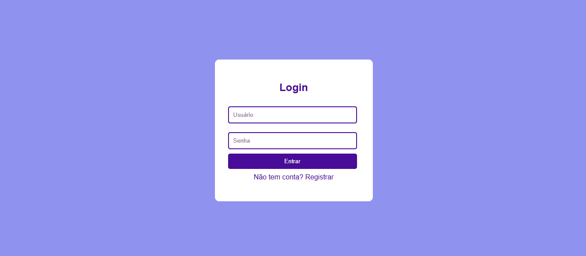

# 📋 Lista de Tarefas (Fullstack)


Aplicação fullstack de gerenciamento de tarefas com autenticação de usuários, desenvolvida para estudo de arquitetura moderna com separação de responsabilidades (frontend + API).

---

## 🎥 Demonstração



---

## 🚀 Tecnologias

### Backend
- FastAPI
- SQLAlchemy
- SQLite
- JWT (python-jose)
- Passlib (bcrypt)

### Frontend
- JavaScript (ES Modules)
- HTML5 + CSS3
- Fetch API

---

## ✨ Funcionalidades

- 🔐 Autenticação com JWT
- 👤 Registro e login de usuários
- 📌 CRUD completo de tarefas
- 🔍 Filtro por status
- 📊 Contador de tarefas
- 🔒 Isolamento por usuário

---

## 🧱 Arquitetura

Frontend (JS modular)
↓
Fetch API
↓
Backend (FastAPI)
↓
SQLAlchemy ORM
↓
SQLite

---

## 🔐 Autenticação

- Token JWT armazenado no `localStorage`
- Enviado via header:

---

- Proteção de rotas no backend
- Cada usuário acessa apenas seus dados

---

## ⚙️ Como rodar o projeto

### 1. Backend

```bash
pip install fastapi uvicorn sqlalchemy passlib[bcrypt] python-jose
python -m uvicorn backend.main:app --reload
```
---
### 2. Frontend
```bash
cd frontend
python -m http.server 5500

Acesse:

http://localhost:5500/login.html
```
---

🔄 Fluxo da aplicação
Usuário se registra
Realiza login
Recebe token JWT
Token é salvo no navegador
Requisições autenticadas são feitas
Backend valida e retorna dados do usuário
🐛 Problemas comuns
404 no login

✔ Use /auth/login

Não cria tarefas

✔ Verifique token no header

Erro de import no backend

✔ Use imports com backend.

---

📈 Melhorias futuras
 Logout
 Refresh token
 UI moderna (React)
 Deploy em produção
 Docker
 Testes automatizados
📌 Status

🚧 Projeto em evolução — foco em aprendizado de arquitetura fullstack

👨‍💻 Autor

Desenvolvido por Rodrigo

📄 Licença

MIT